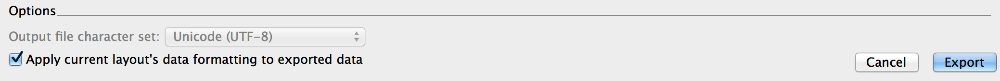

# fmpxmlresult2psqlCOPY
FileMaker XML result to PostgreSQL COPY including current selection of records.

This is a PoC( Proof of Concept )

Works fine with all field types but content may or may not be a bit tricky for multi line content( may or may not be fixed if I need this feature eventually ) and repeating fields( This is just a stupid concept( back in the day it might have had been an approach to achieve array, but this is 2016 for crying out loud ) in the first place I CCL( Couldn't Care Less. ) )

Note that adding a layout name in the FMPXMLRESULT export; before translating using this XSLT, will make the output more complete.

How to use this file in terminal
---
xsltproc FMPXMLRESULT2psqlCOPY.xslt YourTable.fmpxmlresult.xml > YourTable.sql

Depending on your user base* you may or may not want to run
---
tidy -i -xml -wrap 0 -utf8 YourTable.fmpxmlresult.xml \> YourTable.tidy.fmpxmlresult.xml 

* How much control structures did they manage fill into your fields.

and then 
---
xsltproc FMPXMLRESULT2psqlCOPY.xslt YourTable.tidy.fmpxmlresult.xml \> YourTable.sql

To minimize editing in the .sql file you would really like to edit your fmpxmlresult.xml file to match the following criteria \<DATABASE LAYOUT="tablename" NAME="schemaname" /\> as pr example: \<DATABASE LAYOUT="contact" NAME="public" />

FYI: schema in pg is like a folder for tables, can be nifty sometimes, if you do not need this feature, just use the default one, named: public

License
=======

Copyright (c) 2008 Gjermund Gusland Thorsen, released under the MIT License.

All rights deserved.

Permission is hereby granted, free of charge, to any person obtaining a copy of this software and associated documentation files (the "Software"), to deal in the Software without restriction, including without limitation the rights to use, copy, modify, merge, publish, distribute, sublicense, and/or sell copies of the Software, and to permit persons to whom the Software is furnished to do so, subject to the following conditions:

The above copyright notice and this permission notice shall be included in all copies or substantial portions of the Software.

This piece of software comes with ABSOLUTELY NO WARRANTY, to the extent permitted by applicable law.
